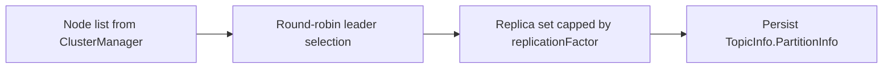
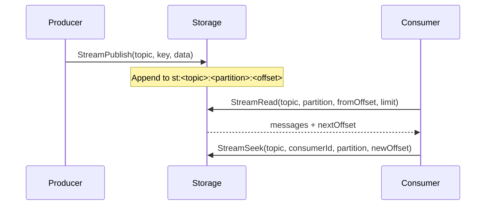
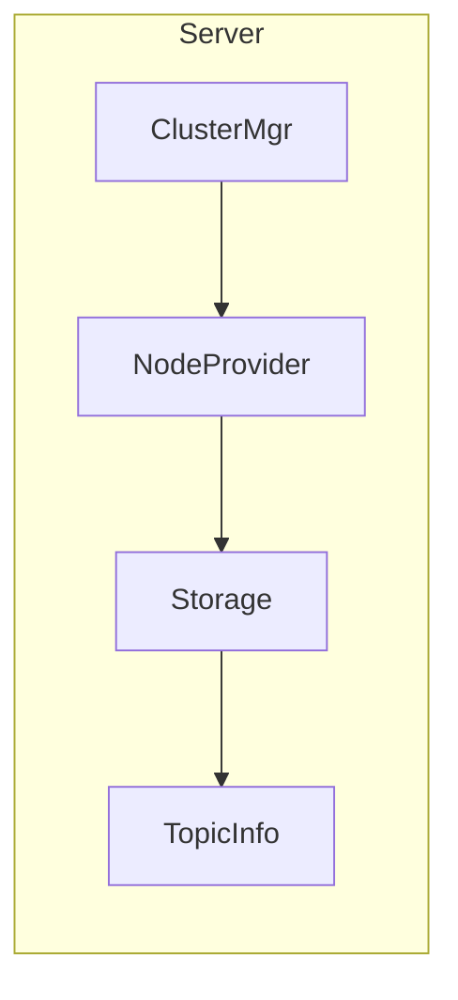
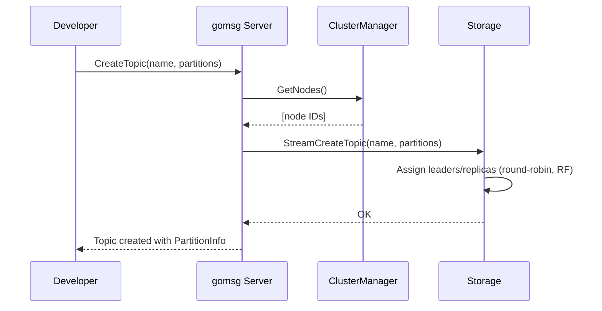

# Clustering, Partitions, and Replication in gomsg

This document explains, in beginner-friendly terms first, what clustering, partitions, and replication mean. Then it shows how these ideas are applied in gomsg, and how they integrate with the KV store, Queues, Streams, and the gRPC server.

Status: Raft-based consensus is disabled by default. The system currently uses an in-memory Cluster Manager for membership and leader hints. Replication factor is applied to stream topic metadata, while data replication is planned for a future phase.

---

## Primer: What are clustering, partitions, and replication?

- **Clustering**
  A cluster is a set of machines (nodes) that cooperate to provide a single logical service. Clustering helps scale throughput (more machines) and improves availability (one node can fail while others continue serving).

- **Partitions**
  Data is split into independent chunks (partitions). Each partition can be handled by a different node. This increases parallelism. In a log-based stream (like Kafka), partitions are ordered logs; each message belongs to exactly one partition.

- **Replication**
  Each partition can be copied to multiple nodes (replicas). One replica is the leader; others are followers. The leader handles writes; followers copy the data. If the leader fails, a follower can take over.

### Leaders and followers

- The **leader** for a partition is the authoritative replica that accepts writes.
- **Followers** replicate the leader’s data. Some systems require a majority of replicas (a quorum) to acknowledge a write before success is returned—this protects against data loss.

### Why partitions and replication together?

- Partitions scale horizontally (more partitions = more parallelism).
- Replication provides resilience (more replicas = higher durability and availability).

### Offsets (for streams)

- Each partition is an append-only log with monotonically increasing offsets. Consumers track their last processed offset per partition.

---

## Quick glossary

- **Node**: A single running instance (server) in the cluster.
- **Topic** (streams): A named feed of messages split into partitions.
- **Partition**: An ordered sequence of messages. Ordering guaranteed only within a partition.
- **Leader**: The replica that accepts writes for a partition.
- **Follower**: A replica that receives data from the leader.
- **Replication factor (RF)**: Number of replicas per partition (leader + followers).
- **Offset**: Position of a message within a partition.

---

---

## Components and responsibilities

- **pkg/server/**
  - `server.go`: Initializes services and wires storage to cluster membership via a NodeProvider.
  - `cluster_service.go`: Exposes cluster membership and leader info over gRPC.
- **pkg/cluster/**
  - `manager.go`: In-memory cluster manager for membership (Join/Leave/Heartbeat) and leader determination (smallest NodeID).
- **pkg/cluster/raft/** (behind build tag `raft_enabled`)
  - Planned production consensus (HashiCorp Raft). Disabled by default.
- **storage/**
  - `badger_stream.go`: Topic creation, partition metadata, and stream storage.
  - `badger_kv.go`: Badger-backed KV and stream internals, NodeProvider and replication factor hooks.
  - `composite.go`: Routes KV to memory (default) or Badger; Queues/Streams always on Badger.
  - `memory_kv.go`: RAM-backed KV (Redis-like) with TTL, increments, batch ops.

---

## Membership and leader info

- The **in-memory Cluster Manager** (`pkg/cluster/manager.go`) is the source of truth for node membership in the current mode.
- It exposes:
  - `Join(id, address)`, `Leave(id)` for dynamic membership.
  - `GetNodes()`, `GetLeader()` to discover nodes and leader (deterministic: smallest NodeID) used primarily for topic partition placement.
- The **server** adapts the manager to a **NodeProvider** and sets it on storage:
  - `BadgerStorage.SetNodeProvider(...)`
  - or `CompositeStorage.SetNodeProviderIfSupported(...)`
- The NodeProvider provides a list of node IDs/addresses for partition assignment in `StreamCreateTopic`.

---

## Partitions and replication for Streams

- Each stream topic is created with a configured number of partitions.
- Replication factor is configured via `config.Cluster.Replicas` and propagated to storage with:
  - `BadgerStorage.SetReplicationFactor(n)`
  - or `CompositeStorage.SetReplicationFactorIfSupported(n)`

### Partition metadata

When you call `storage.StreamCreateTopic(ctx, topic, partitions)`:
- Storage inspects cluster membership from NodeProvider.
- For each partition `i`:
  - Chooses a leader: `leader = nodes[i % len(nodes)]` (round-robin across nodes)
  - Chooses a replica set capped by `replicationFactor`:
    - Start at leader index and wrap around until `rf` nodes are chosen, ensuring the leader is included.
- Persists `TopicInfo` under `tp:<topic>` with:
  - `PartitionInfo[]` each containing `ID`, `Leader`, `Replicas`, and the last known `Offset`.

### Simple example

Say you have 3 nodes: `[n1, n2, n3]`, RF=2, and you create a topic with 4 partitions.

- p0 → leader n1, replicas [n1, n2]
- p1 → leader n2, replicas [n2, n3]
- p2 → leader n3, replicas [n3, n1]
- p3 → leader n1, replicas [n1, n2]



Note: Today, this is metadata-only placement. Data replication for stream appends is planned (see Roadmap).

---

## How Streams store data and offsets

- Messages are appended under keys `st:<topic>:<partition>:<offset>` in Badger.
- Offsets are generated per partition using Badger sequences (contention-free monotonic IDs).
- Reads scan by prefix from a requested offset and return up to `limit` messages.
- Consumer offsets are managed by `StreamSeek`/`StreamGetOffset` and surfaced by the `pkg/stream` Consumer.



---

## Integration with Producer/Consumer (pkg/stream)

- `Producer` performs client-side batching and uses a partitioner (default hash) to choose a partition key.
- `Consumer` launches per-partition workers that poll `StreamRead`, invoke the handler, and auto-commit offsets via `StreamSeek`.
- The `Manager` provides topic CRUD and metadata retrieval.
- These APIs leverage the placement set in `TopicInfo.PartitionInfo`. When data replication is introduced, the Producer can prefer the leader for low-latency writes.

### Example: creating a topic with replication factor

```go
// Assume store is CompositeStorage (KV=memory; Streams=Badger)
// and cluster manager has a few nodes joined.
ctx := context.Background()
if err := store.StreamCreateTopic(ctx, "orders", 6); err != nil {
    panic(err)
}
info, _ := store.StreamGetTopicInfo(ctx, "orders")
for _, p := range info.PartitionInfo {
    fmt.Printf("p=%d leader=%s replicas=%v\n", p.ID, p.Leader, p.Replicas)
}
```

---

## KV and Queue interaction with clustering

- **KV** (default in-memory):
  - Does not use clustering/replication in the current mode; it is local and ephemeral by design.
  - You can flip to persistent KV (`storage.kv_backend: badger`) if you need on-disk persistence.
- **Queue**: always backed by Badger and local to the node.
  - Queue semantics (ready/delayed indices, retry with backoff) are independent of clustering in the current mode.
  - In future clustered mode, queue partitioning and mirror/replica strategies can be introduced similar to streams.

---

## Server wiring (current)

- On startup (`pkg/server/server.go`):
  - Creates an in-memory `cluster.Manager`.
  - If backing storage is `BadgerStorage` or `CompositeStorage`, sets NodeProvider and replication factor so streams can assign leaders/replicas.
  - Registers gRPC services: `KVService`, `QueueService`, `ClusterService`.
  - Stream service is available but gated by build tag until gRPC stubs are generated.



### End-to-end creation flow (beginner view)



---

## Failure and resilience (current vs future)

- **Current** (no Raft):
  - Cluster membership is in-memory; restart will lose membership state.
  - Topic leader/replica metadata is persisted, but data replication is not enforced.
  - Recommended for dev or single-node setups.

- **Future** (with Raft or another consensus):
  - Replicated, durable membership via Raft.
  - All mutating operations (KV/Queue/Stream) are proposed to be replicated via an FSM.
  - Stream publish will be replicated to follower nodes, with quorum acks and ISR management.

---

## Roadmap for clustering and replication

- **Consensus**: Re-enable HashiCorp Raft (or pluggable consensus) with a storage-backed FSM for KV/Queue/Stream mutations.
- **Stream replication**: Add `STREAM_PUBLISH` commands or a dedicated replication RPC path with quorum ACKs.
- **Rebalancing**: When nodes join/leave, support partition reassignments with safe handover.
- **Queue partitioning**: Partition queues similar to topics; optional replication for durability.
- **Client routing**: Expose leader metadata via the ClusterService to route client writes to leaders.

---

## Configuration summary

- `cluster.enabled`: Currently ignored for consensus; clustering uses in-memory manager.
- `cluster.replicas`: Replication factor for stream topics (metadata assignment only for now).
- `storage.kv_backend`: `memory` (default) or `badger` for persistent KV.

---

## Frequently asked questions

- **Is data replicated between nodes now?**
  - No. Leaders/replicas are assigned in metadata, but replication is not enforced in the current mode. This is planned when consensus is reintroduced.

- **Why is KV in-memory by default?**
  - To provide Redis-like speed and simplicity for cache/session/state use cases. You can switch to persistent KV on SSD by setting `storage.kv_backend: badger`.

- **Do partitions guarantee ordering?**
  - Within a partition, offsets are monotonic and append order is preserved. Cross-partition ordering is not guaranteed.

- **How do I pick the number of partitions and replicas?**
  - Partitions scale parallelism. Replicas (metadata) prepare for future replication; for now they inform placement.

---

## References

- Server wiring: `pkg/server/server.go`
- Cluster manager: `pkg/cluster/manager.go`
- Stream storage: `storage/badger_stream.go`
- KV backends: `storage/memory_kv.go`, `storage/badger_kv.go`, `storage/composite.go`
- Stream client: `pkg/stream/`
- Raft (future, behind build tag): `pkg/cluster/raft/`
