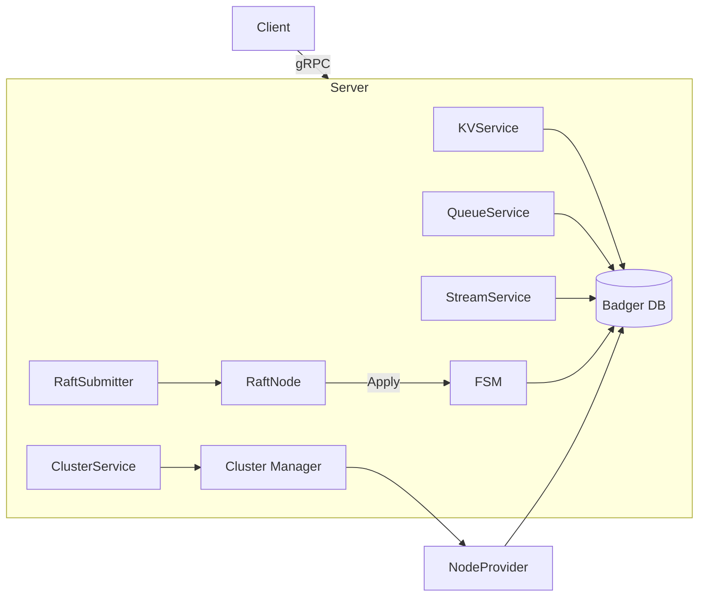
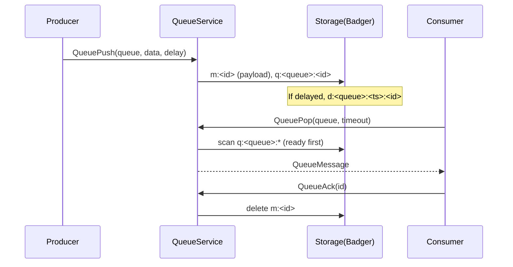
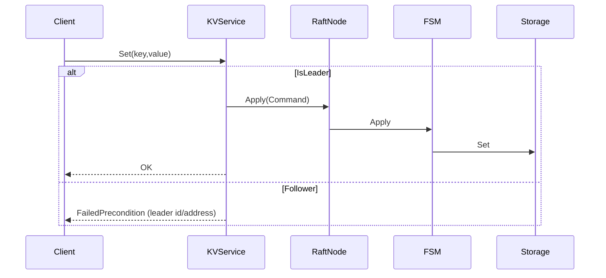

# gomsg Implementation Guide

This document explains how gomsg is structured and how the major subsystems work together: KV, Queue, Streams (pub/sub), and Clustering. It also covers server wiring, storage design, and operational notes.

## Repository structure (relevant parts)

- `pkg/server/`
  - gRPC service implementations and server bootstrap.
  - Wires storage, clustering, and (optionally) stream services.
- `storage/`
  - Badger-backed storage implementation for KV, Queues, and Streams.
- `pkg/stream/`
  - Client-facing high-level streaming library (Producer, Consumer, Manager) built on `storage` APIs.
- `pkg/cluster/`
  - Cluster management primitives.
  - `pkg/cluster/raft/`: HashiCorp Raft node and FSM scaffolding.
- `api/proto/`
  - gRPC proto definitions.
  - Generate to `api/generated/*` (not committed here).

## Server wiring

Entry point for services is the `pkg/server/server.go` `Server` type.

- On startup, `Server` constructs:
  - `KVService`, `QueueService`, `ClusterService`. Stream service can be enabled after generating stubs.
  - If clustering is enabled in config, a Raft node is started (`pkg/cluster/raft/node.go`).
  - A `cluster.Manager` is created for membership and leader info (currently in-memory; planned: Raft-backed facade).
  - A `nodeProviderAdapter` is registered on storage so streams can assign leaders/replicas using current membership.
  - If Raft is enabled, a `Submitter` is attached to route mutating writes through Raft.

Services communicate with storage via the `storage.Storage` interface defined in `storage/interface.go`.

## Storage (Badger)

The `BadgerStorage` implements:

- KV primitives:
  - `Set`, `Get`, `Delete`, `Exists`, `Expire`, `TTL`, `Increment/Decrement`, `MSet`, `MGet`.
- Queues:
  - `QueuePush`, `QueuePop`, `QueuePeek`, `QueueAck`, `QueueNack`, `QueueStats`, `QueuePurge`, `QueueDelete`, `QueueList`.
- Streams (pub/sub-like persistent logs):
  - `StreamPublish`, `StreamRead`, `StreamSeek`, `StreamGetOffset`, `StreamCreateTopic`, `StreamDeleteTopic`, `StreamListTopics`, `StreamGetTopicInfo`.

Important storage implementation details:

- Badger v4 iterator API:
  - Use `Iterator.ValidForPrefix(prefix)` instead of `Item.HasPrefix()`.
  - Use `Item.ValueCopy(nil)` to read values from an iterator item.
- Stream offsets:
  - Offsets are generated per topic-partition using Badger Sequences (monotonic IDs) to avoid hot-key contention.
- Topic metadata:
  - `TopicInfo.PartitionInfo` is stored under a `tp:` key. On creation, partitions get leader and replica assignments derived from cluster membership.
  - Replication factor is configurable via `BadgerStorage.SetReplicationFactor(n)`. Leader is included and replicas are chosen round-robin.

## Streams (pub/sub)

Two pieces comprise streams:

1. `storage/` stream API:
   - Messages are stored under `st:<topic>:<partition>:<offset>` keys.
   - Topic metadata under `tp:<topic>` contains `Partitions`, `PartitionInfo` (leaders/replicas), and totals.
   - Offsets are per-partition via sequences; `StreamRead` seeks directly to `fromOffset` and iterates while prefix matches.

2. `pkg/stream/` high-level client:
   - `Producer`: buffered, batched writes that call `StreamPublish`.
   - `Consumer`: per-partition workers, fetch batches via `StreamRead`, and auto-commit offsets via `StreamSeek`.
   - `Manager`: topic create/delete/info plus helper constructors for Producer/Consumer.

Notes:
- The current Producer uses batching at the client side; the storage layer can be extended to batch multiple writes into a single `WriteBatch` for higher throughput.
- The Consumer handles offset progression and batch fetching; partition parallelism is supported.

## Queues

- Backed by Badger keys with queue index prefixes:
  - Queue index keys: `q:<queue>:<messageID>` → messageID
  - Message keys: `m:<messageID>` → message payload and metadata (created at, retry count, delay).
  - Delayed queue: `d:<queue>:<unixTs>:<messageID>` moves to ready index when time elapses.
- `QueuePop` scans ready messages first; if none, it inspects delayed messages and promotes those ready for consumption.
- `QueueNack` increments retry count and requeues with exponential backoff.

## Clustering

Two layers exist:

1. `pkg/cluster.Manager` (in-memory for now):
   - Tracks nodes with `Join`, `Leave`, `Heartbeat`.
   - Leader election is deterministic (smallest NodeID). API provides `GetLeader`, `GetNodes`.
   - Used to provide membership/leader info to storage for leader/replica assignment.

2. `pkg/cluster/raft` (HashiCorp Raft):
   - `node.go`: starts Raft with TCP transport, Bolt `StableStore`/`LogStore`, and file snapshots.
   - `fsm.go`: defines a real Raft FSM with a versioned `Command` envelope. Initially supports:
     - KV: `KV_SET`, `KV_DELETE`
     - Streams: `STREAM_CREATE_TOPIC`, `STREAM_DELETE_TOPIC`
   - `submit.go`: Submitter helper to apply commands and wait with a timeout.
   - `fsm_noop.go`: no-op FSM kept for fallback.

### Leader-aware writes

- With Raft enabled, writes should go through the leader.
- `pkg/server/kv_service.go` demonstrates this pattern:
  - If the node is not leader, return a status that includes leader ID/address (client can retry against leader).
  - If leader, build an FSM `Command` and submit via Raft; Apply will call storage.
- Reads are served locally from storage for low latency.

### Topic replication factor

- `BadgerStorage.SetReplicationFactor(n)` sets desired replica count for stream topics.
- `StreamCreateTopic` uses membership from NodeProvider and chooses a leader and `n-1` replicas, capped by the number of nodes.
- Replication pipeline (leader → replicas for publish) is planned via Raft `STREAM_PUBLISH` or a dedicated replication RPC path.

## gRPC services

- `pkg/server/kv_service.go`: KV RPCs implemented. Mutations (Set/Del) route through Raft when enabled, others can be wired similarly.
- `pkg/server/queue_service.go`: Queue RPCs (mutations to be Raft-wired in the next steps if required).
- `pkg/server/stream_service.go`: Stream RPCs are implemented but guarded by a build tag (`//go:build stream_enabled`) until generated code exists in `api/generated/stream`. Once generated, remove the tag and re-enable registration in `pkg/server/server.go`.
- `pkg/server/cluster_service.go`: Cluster RPCs backed by `pkg/cluster.Manager` (planned upgrade to Raft-backed facade).

## Configuration (config/config.go)

- `cluster.enabled`: enable Raft-based clustering.
- `cluster.node_id`, `cluster.bind_addr`, `cluster.bootstrap`, `cluster.join_addresses`, `cluster.data_dir` control Raft node identity, address, and state.
- `cluster.replicas`: desired replication factor for stream topics (default 3).

## Developer workflows

- Build:
  - `go mod tidy`
  - Generate gRPC stubs into `api/generated/*` from `api/proto/*.proto`.
  - Enable stream service by removing the build tag once generated.
- Run single-node (no clustering):
  - Ensure `cluster.enabled=false`.
- Run multi-node with Raft:
  - Prepare three nodes with unique `cluster.node_id` and `cluster.bind_addr`.
  - Bootstrap the first node (`cluster.bootstrap=true`), join others via `cluster.join_addresses` or Join RPC.
- Testing:
  - KV: set/get/del; non-leader writes should return a leader redirect message with leader ID and address.
  - Streams: create topic, publish messages, read from offsets; replication factor is reflected in `TopicInfo` (leaders/replicas).

## Future work (roadmap)

- **[Raft FSM]** Extend commands: `MSET`, `EXPIRE`, `INCR/DECR`, `STREAM_PUBLISH`, `STREAM_SEEK`, `QUEUE_*` mutations.
- **[Snapshots]** Implement snapshot/restore to/from Badger backup for fast recovery.
- **[Replication]** Optionally add a replication RPC path for StreamPublish in addition to Raft (for throughput), while keeping Raft as the source of truth.
- **[Load balancing]** Client libraries can use leader discovery from ClusterService to route writes.
- **[Observability]** Metrics and tracing across services and storage.

## Key internal references

- Server: `pkg/server/server.go`
- KV Service: `pkg/server/kv_service.go`
- Stream Service (build-tagged): `pkg/server/stream_service.go`
- Cluster Service: `pkg/server/cluster_service.go`
- Storage interface: `storage/interface.go`
- Badger storage: `storage/badger_kv.go`, `storage/badger_queue.go`, `storage/badger_stream.go`
- Stream client package: `pkg/stream/`
- Cluster Manager: `pkg/cluster/manager.go`
- Raft Node & FSM: `pkg/cluster/raft/`

---

## Quickstart (single node)

1) Build and run with default config (single node, clustering disabled):

```bash
go mod tidy
go run ./cmd/gomsg
```

2) Use the CLI to put/get KV:

```bash
go run ./cmd/cli set mykey hello
go run ./cmd/cli get mykey
```

3) Create a stream topic and publish/read (after generating stream stubs and enabling the service):

```bash
# see Streams examples below
```

---

## High-level architecture



- **Server** registers gRPC services and (optionally) a **Raft** node when `cluster.enabled=true`.
- **Leader-aware writes**: Mutations route through the leader using Raft. Reads go to local storage.
- **FSM** applies committed log entries deterministically to **storage**.
- **ClusterMgr** provides membership and leader info; **NodeProvider** informs stream partition leader/replica assignment.

---

## KV: Usage and semantics

### Consistency

- **Writes** (with Raft enabled): only the leader accepts and replicates via Raft; followers return a leader-redirect.
- **Reads**: from local state (eventually consistent on followers, consistent on leader after commit).

### Go example: direct gRPC client (kvpb)

```go
package main

import (
    "context"
    "fmt"
    "time"
    "google.golang.org/grpc"
    kvpb "gomsg/api/generated/kv" // ensure stubs are generated
)

func main() {
    conn, _ := grpc.Dial("localhost:9000", grpc.WithInsecure())
    defer conn.Close()
    cli := kvpb.NewKVServiceClient(conn)

    // Set
    _, err := cli.Set(context.TODO(), &kvpb.SetRequest{Key: "user:1:name", Value: []byte("alice"), Ttl: 0})
    if err != nil { panic(err) }

    // Get
    resp, _ := cli.Get(context.TODO(), &kvpb.GetRequest{Key: "user:1:name"})
    fmt.Println(string(resp.Value))

    // Expire
    _, _ = cli.Expire(context.TODO(), &kvpb.ExpireRequest{Key: "user:1:name", Ttl: int64((5 * time.Second).Seconds())})
}
```

### Leader redirect example (non-leader node)

If you `Set` on a follower, the service responds with a FailedPrecondition and a message:

```
not leader; leader=node-1@127.0.0.1:9000
```

Your client should retry the write to the leader.

---

## Queue: Usage and behavior

### Data flow



### Go example: storage-level usage

```go
msgID, _ := store.QueuePush(ctx, "emails", []byte("hello"), 0)
msg, _ := store.QueuePop(ctx, "emails", 2*time.Second)
_ = store.QueueAck(ctx, msg.ID)
```

### Retries and delay

- `QueueNack` increments `RetryCount` and re-schedules with increasing delay.
- Delayed messages are indexed under `d:<queue>:<unixTs>:<id>` and promoted to ready index when due.

---

## Streams (pub/sub-like persistent logs)

### Partitions, leaders, replicas

- Each topic has `N` partitions. Leaders/replicas are chosen from cluster nodes.
- Replication factor is set via `cluster.replicas` (default 3, capped by nodes). Leader is always included.

### Offsets and reads

- Offsets are per-partition and monotonic, generated via Badger sequences.
- `StreamRead(topic, partition, fromOffset, limit)` seeks to a lexicographic key and scans while prefix matches.

### Go example: Producer/Consumer (`pkg/stream`)

```go
mgr := stream.NewManager(store) // store implements storage.Storage

// Producer
prod := mgr.NewProducer(stream.DefaultPartitioner, stream.ProducerOptions{})
defer prod.Close()
prod.Produce(stream.Record{Topic: "orders", PartitionKey: "customer-42", Data: []byte(`{"id":1}`)})

// Consumer (single process consuming all partitions)
handler := func(ctx context.Context, m stream.Message) error {
    fmt.Printf("[%s p=%d o=%d] %s\n", m.Topic, m.Partition, m.Offset, string(m.Data))
    return nil
}
cons := mgr.NewConsumer("orders", "orders-worker", handler, stream.ConsumerOptions{})
_ = cons.Start()
defer cons.Close()
```

### Stream service (gRPC)

Once `api/generated/stream` is generated and the build tag is removed, use `pkg/server/stream_service.go` to publish/read topics over gRPC. The storage layer already supports the full functionality; the service file is gated with `//go:build stream_enabled` to keep builds green until stubs exist.

---

## Clustering and Raft

### Membership and leader info

- `pkg/cluster/manager.go` tracks nodes (Join/Leave/Heartbeat) and computes a leader (smallest NodeID). This is used for:
  - User-facing ClusterService responses.
  - NodeProvider to assign stream leaders/replicas on topic creation.

### Raft consensus (HashiCorp Raft)

- `pkg/cluster/raft/node.go` starts the Raft node:
  - TCP transport
  - Bolt-based LogStore and StableStore
  - File snapshot store
- `pkg/cluster/raft/fsm.go` defines a versioned `Command` envelope and a storage-backed FSM:
  - Implemented commands: `KV_SET`, `KV_DELETE`, `STREAM_CREATE_TOPIC`, `STREAM_DELETE_TOPIC`
  - Deterministic `Apply()` calls `storage` methods.
- `pkg/cluster/raft/submit.go` provides a `Submitter` with `Submit(ctx, cmd, timeout)`; services use this to submit mutations when node is leader.

### Leader-aware writes (pattern)



### Example: Raft command for KV_SET (service side)

```go
payload, _ := json.Marshal(struct{
  Key string `json:"k"`
  Value []byte `json:"v"`
  TTLSeconds int64 `json:"ttl"`
}{Key: req.Key, Value: req.Value, TTLSeconds: int64(req.Ttl)})
cmd := raftex.Command{Version: 1, Type: raftex.CmdKVSet, Payload: payload}
if err := submitter.Submit(ctx, cmd, 0); err != nil { /* return error */ }
```

### Stream leader/replica assignment

- In `storage/BadgerStorage.StreamCreateTopic`: leaders and replicas are selected from `NodeProvider.ListNodes()` using a round-robin scheme and capped by `replicationFactor`.

---

## Operational guidance

### Single-node vs clustered

- Single-node (fast dev): set `cluster.enabled=false`. All writes go directly to storage.
- Clustered with Raft:
  - `cluster.enabled=true`
  - First node: `cluster.bootstrap=true`
  - Others: `cluster.join_addresses=["leader_addr"]`

### Generating gRPC stubs

- Generate code from `api/proto/*.proto` into `api/generated/*` using `protoc` or `buf`.
- After generating `stream` stubs, remove `//go:build stream_enabled` guard in `pkg/server/stream_service.go` and re-enable stream server registration in `pkg/server/server.go`.

### Tuning & performance

- **Producer batching**: increase `ProducerOptions.MaxBatch` and `Linger`.
- **Badger sequences bandwidth**: can be increased internally to reduce contention if needed.
- **Iterator prefetch**: keep off for scans that don’t need values; keep on for `StreamRead`.
- **Replication factor**: set `cluster.replicas` per your durability and throughput needs.

---

## Roadmap (expanded)

- **FSM coverage**: add `MSET`, `EXPIRE`, `INCR/DECR`, `STREAM_PUBLISH`, `STREAM_SEEK`, and Queue mutations.
- **Snapshots**: call `storage.Backup/Restore` from FSM Snapshot/Restore.
- **Leader proxy**: optional server-side proxy for non-leader writes to improve UX.
- **Stream replication**: either via Raft log (publish command) or an optimized replication RPC path.
- **Observability**: metrics, tracing, and Raft/Badger health endpoints.
